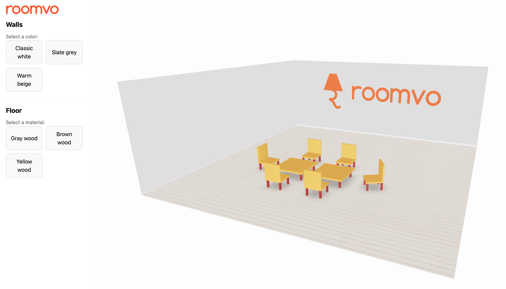

# Three.js Room Customizer Demo

Minimal demo project using React, TypeScript, Vite, and Three.js (via React Three Fiber).

## Features
- 3D room viewer with customizable floor textures and wall colors
- Responsive sidebar for quick changes

## Getting Started
1. Install dependencies:
   ```bash
   npm install
   ```
2. Start the development server:
   ```bash
   npm run dev
   ```

## Build
```bash
npm run build
```

## Lint
```bash
npm run lint
```

## Screenshot

